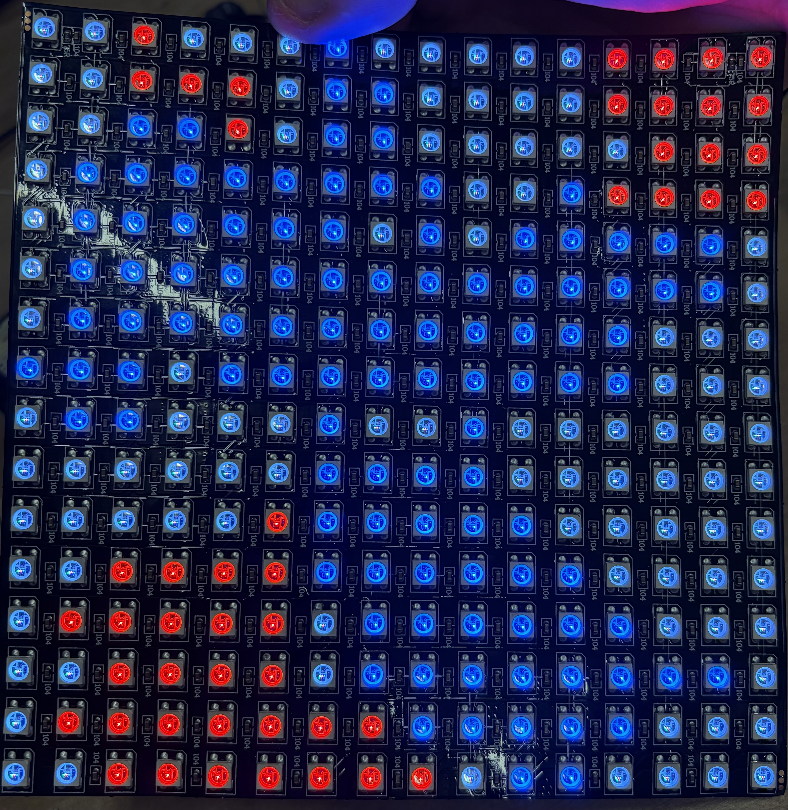
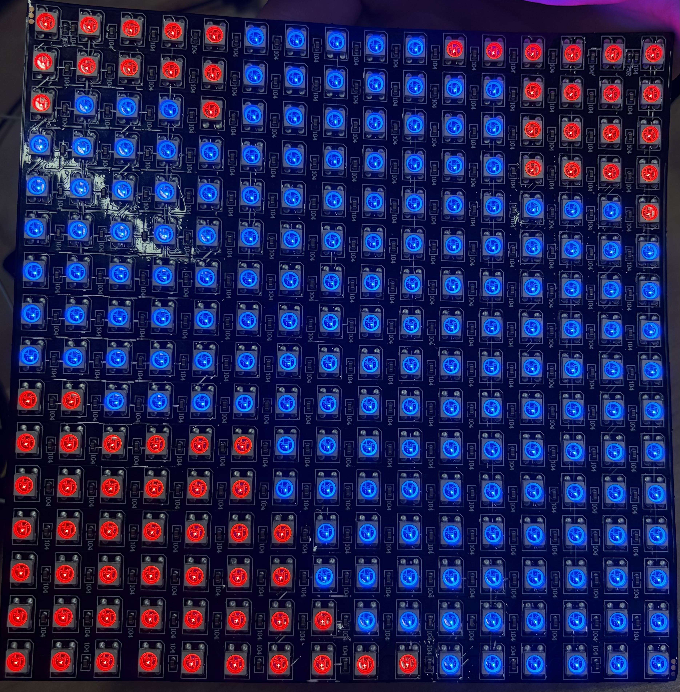

   

## Tile Growth Simulator Project

Tile Growth Simulator is an interactive cellular simulation displayed on a 16×16 LED matrix. On reset, the grid starts blank with a green cursor that can be moved using the directional buttons. The place button colors the tile at the cursor's current position, and the color select button cycles between red and blue. Once the game starts, placed tiles begin spreading outward randomly, growing in random directions at random intervals, filling blank spaces and competing against tiles of the opposing color. The simulation ends when no blank tiles remain. The grid can then be reset and the game played again.

- [Read the documentation for the TileGrowth Simulator](docs/info.md)
- [Read the documentation on testing the TileGrowth Simulator](test/README.md)

## Game Flow

Pre-game:

Early-game:

Mid-game:

End-game:

